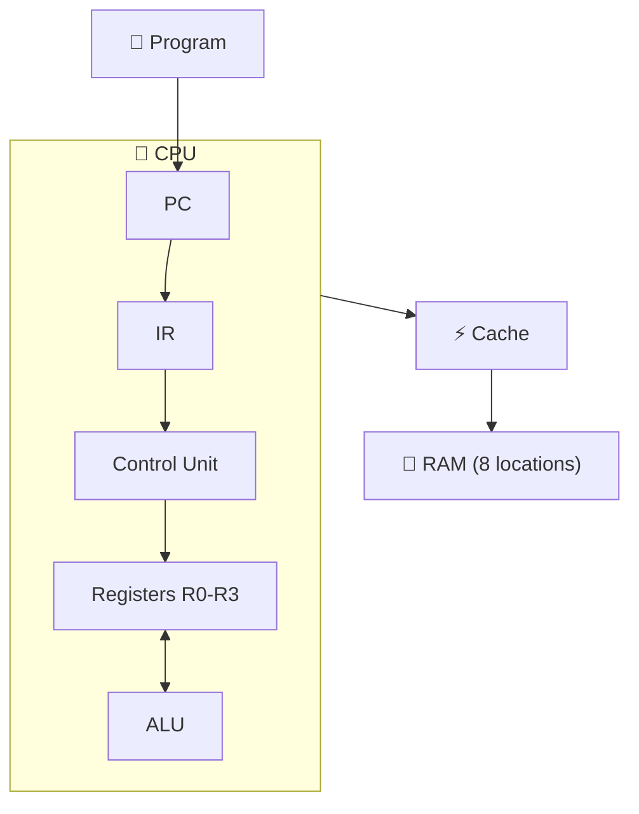
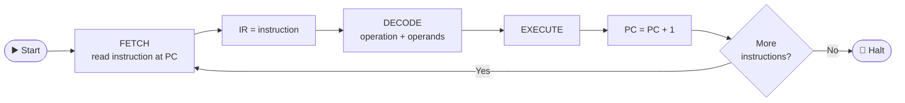
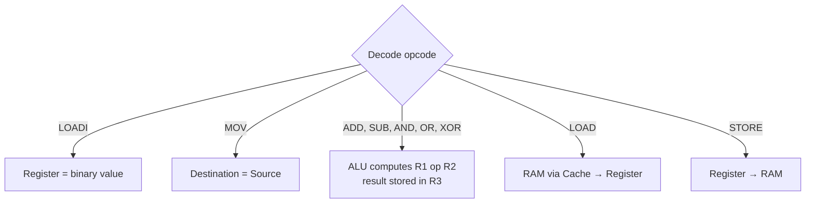
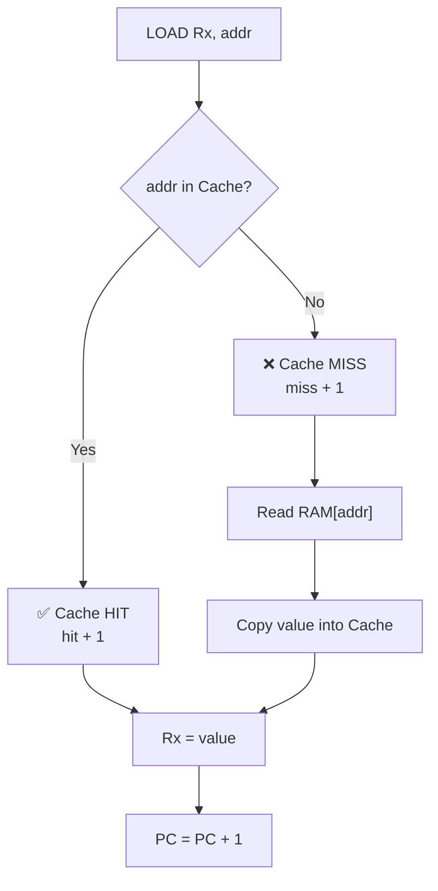
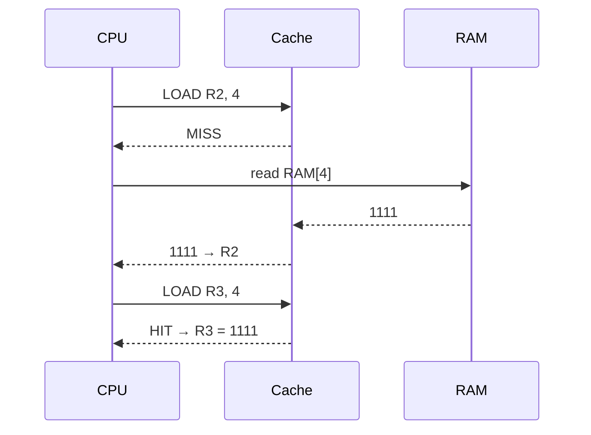
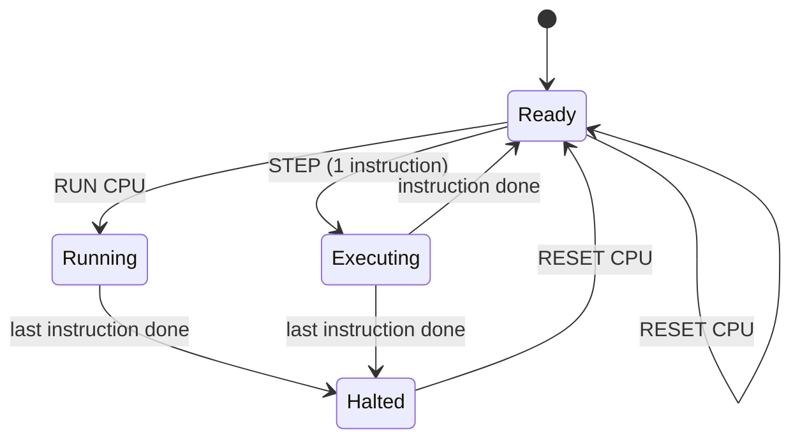

<div align="center">

# 🖥️ Mini Computer Simulator

**An interactive Computer Organization & Architecture (COA) simulator**
See how CPU, Registers, ALU, RAM and Cache work together, one instruction at a time.

[](https://mini-computer-simulator.netlify.app/)


</div>

---

## 📑 Quick Navigation

[✨ Features](#features) · [🏗️ Architecture](#architecture) · [🔄 Workflows](#workflows) · [💾 Instruction Set](#instruction-set) · [🧪 Try It Yourself](#try-it-yourself) · [📂 Structure](#project-structure) · [🚀 Roadmap](#roadmap)

---

## Features

| Module | What it does |
|--------|--------------|
| 🔢 **Binary Calculator** | Binary ↔ Decimal conversion, 4-bit binary addition |
| ➕ **ALU** | ADD, SUB, AND, OR, XOR, NOT |
| 🧠 **CPU** | 4 registers (`R0–R3`), Program Counter (PC), Instruction Register (IR) |
| 🎛️ **Control Unit** | FETCH → DECODE → EXECUTE cycle |
| 💾 **RAM** | 8 memory locations with `LOAD` / `STORE` |
| ⚡ **Cache** | Cache Hit / Miss tracking |
| ▶️ **Controls** | `STEP` · `RUN CPU` · `RESET CPU` |

---

## Architecture



---

## Workflows

> 👇 Click any section to expand the diagram.

<details open>
<summary><b>🔄 1. Instruction Cycle (Fetch → Decode → Execute)</b></summary>



</details>

<details>
<summary><b>⚙️ 2. Execute Stage: what happens for each instruction</b></summary>



</details>

<details>
<summary><b>⚡ 3. LOAD with Cache (Hit vs Miss)</b></summary>



</details>

<details>
<summary><b>🔁 4. Cache Demo: sequence view</b></summary>



</details>

<details>
<summary><b>▶️ 5. Simulator Controls (STEP / RUN / RESET)</b></summary>



`RESET CPU` clears Registers, PC, IR, RAM, Cache and Hit/Miss counters.

</details>

---

## Instruction Set

<details open>
<summary><b>📖 Click to view all instructions</b></summary>

| Instruction | Example | Description |
|-------------|---------|-------------|
| `LOADI` | `LOADI R1, 1010` | Load a binary value into a register |
| `MOV` | `MOV R0, R1` | Copy one register into another |
| `ADD` | `ADD R1, R2` | R1 + R2 → `R3` |
| `SUB` | `SUB R1, R2` | R1 − R2 → `R3` |
| `AND` / `OR` / `XOR` | `AND R1, R2` | Bitwise operation on R1 and R2 |
| `LOAD` | `LOAD R2, 4` | `RAM[4]` → R2 (through cache) |
| `STORE` | `STORE R1, 4` | R1 → `RAM[4]` |

</details>

---

## Try It Yourself

1. Open the **[Live Demo](https://mini-computer-simulator.netlify.app/)**
2. Paste a program into the instruction box
3. Click **STEP** to watch PC, IR, registers, RAM and cache change, or **RUN CPU** to execute everything

<details>
<summary><b>🧪 Example 1: Binary Addition</b></summary>

```text
LOADI R1, 1010
LOADI R2, 0011
ADD R1, R2
```

**Expected output:** `R3 = 1101` (10 + 3 = 13)

</details>

<details>
<summary><b>🧪 Example 2: RAM + Cache Hit / Miss</b></summary>

```text
LOADI R1, 1111
STORE R1, 4
LOAD R2, 4     ; Cache MISS (fetched from RAM)
LOAD R3, 4     ; Cache HIT  (served from cache)
```

**Expected output:** `R1 = R2 = R3 = 1111` · `RAM[4] = 1111` · **Miss = 1, Hit = 1**

</details>

---

## Project Structure

```text
Mini-Computer-Simulator/
├── index.html   # UI: calculator, ALU, registers, CPU, program input, cache, RAM
├── style.css    # Styling
├── script.js    # Simulator logic (CPU, ALU, RAM, cache, parser)
└── README.md
```

<details>
<summary><b>📚 COA topics covered</b></summary>

Binary system & arithmetic · ALU · CPU registers · Control Unit · PC & IR · Instruction cycle · Instruction set & parsing · Main memory & addressing · LOAD / STORE · Cache memory (Hit / Miss) · CPU–memory interaction

</details>

---

## Roadmap

- [ ] More registers, larger RAM and cache
- [ ] Jump / branch instructions, CALL / RETURN, stack
- [ ] Flags register (Carry, Zero)
- [ ] Addressing modes
- [ ] Pipelining and clock-cycle simulation
- [ ] Better error handling and instruction visualization

---

<div align="center">

### 👨‍💻 Author: **Aman Kumar** · B.Tech CSE

Built as a practical implementation of COA concepts.
If you find this useful, please give it a ⭐

</div>